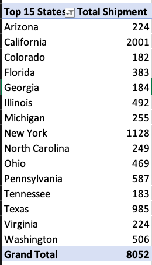
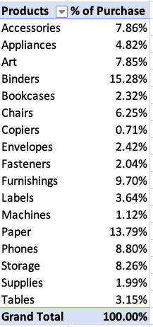

# Excel-Final-Project

## INTRODUCTION
This analysis involves a company's sales performance in the previous year, with data referencing specific areas like: segments, quarter, months, products,countries and more. The analysis is meant to delve into where more attention should be paid to. Pointers will be developed on how the company will perform better and make informed decisions in the coming year?. The analysis is meant to provide KPI's on the company's data and answer certain questions that will enable a more productive outing next year.
## 6 KEY QUESTIONS THAT NEED ANSWERS
- What are the top 15 shipments by state			
- Which Product category has the highest sales			
- Estimated Total sales by states			
- Top ten states with highest profit			
- Product with the highest purchase			
- Most prefered shipping option by customers
- A suitable slicer
## KPI
The Key Performing Index that we will be looking at are;
- Total profit	
- Total sales	 
- Average profit	 
- average sales	 
- sales that make up total profit	12%

We calculate the total profit and total sales by applying the **SUM** function on the respective column. Total profit gave **$286,324.07** and total sales gave **$2,296,957.70**.

We calculate average profit and average sales by applying the average function on the respective column. Average profit gave **$28.65**, while average sales gave **$229.86**.

Finally we calculate the percentage of sales that make up the total profit by dividing total profit by total sales and multiplying the result by 100, which result to **12%**.

## SOLUTION TO QUESTIONS ASKED

The solutions are provided using a pivot table and illustrated graphically on a pivot chart.

**TOP 15 SHIPMENT BY STATE**

The pivot table and chart illustrates the top 15 shipments by state

 

From the table and chart, it is shown that **California** has the highest shipment.

**PRODUCT CATEGORY WITH THE HIGHEST SALES**

The pivot table below shows the technology category, with consumer products raking the highest sale

 

**ESTIMATED TOTAL SALES BY STATE**

To show this analysis, we had to generate the pivot table having the states and sales in their respective pivot table areas to generate the pivot table. We also went further to display or data in a map, showing all the states and their sales. See pivot table and map below

Pivot Table             |  Map
:-------------------------:|:-------------------------:
  |   

From the data analysed, it is observed that **California** has the highest sale.

**TOP TEN STATES WITH THE HIGHEST PROFIT**

It is important to analyse the data for states that generated the highest profit.The result is shown in the pivot table and chart below

The state California grossed the highest, with a profit of **$76,381.39**.

**PRODUCT WITH THE HIGHEST PURCHASE**

I went further to analyse the data based on project that was purchased most, which was shown as percentage. The result is seen below in the pivot table and chart

 

**MOST PREFERED SHIPPING OPTION BY CUSTOMERS**

The data showed that customers used various shipping option to receive their items. The analysis from the pivot table and chart below shows that standard class was the most preferred shipping option.

**SLICER**

The slicer selected to filter the data will be the **STATE** slicer. This slicer will help screen the data states by state. See below

## CONCLUSION AND RECOMMENDATION

The analysis shows that most sales,profit and also shipment was recorded in California. The data also showed areas were massive loss in profit for some items were recorded. Technology and consumer products generated so much sales. Most customers prefered their items shipped with the standard class shipment option. The item 'Binders' from office supplies had the greatest percentage of items purchased. As a result of this data, it can be deduced that the state **California** contributed about **19.92%** of total sales, and **North Dakota** having the lowest of 0.04%. The following recommendations are advised

- More campaings and adverts be carried out in states with very poor sales
- Poducts in corporate and home office category be given a sales boost
- Product and sales that recorded huge loss should be investigated and made sure such losses dont re-occur
- Ads,campaign including suggestions and discount should be given to customers to be open to **SAME DAY** shipping option, which recorded very low on customers preferrence 

